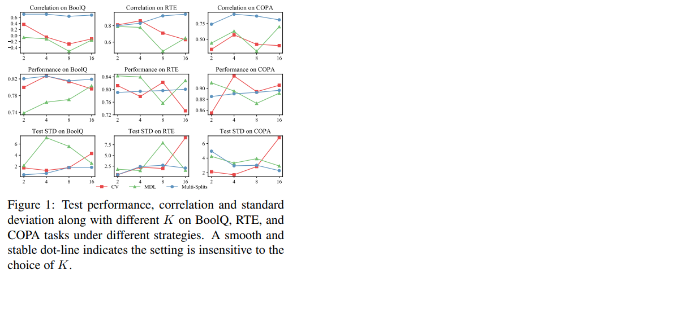

**March 2023,**  **Kavu Maithri Rao**

This blog post is about the paper [FewNLU: Benchmarking State-of-the-Art Methods for Few-Shot Natural Language Understanding](https://arxiv.org/pdf/2109.12742.pdf). 

## Goal of this blog post: 
The goal is to understand examples of several state-of-the-art techniques and data processing, as well as a standard training process and an evaluation framework for few-shot NLU.

## Outline of this Blog Post

1. **Background** 
2. **The problem with the existing evaluation method**
3. **Proposed method**
4. **Main results and analysis**
5. **Limitations**
6. **Conclusion**
7. **References**

# Background
## What is Few-Shot learning?
Pre-trained models have been demonstrated to generalize well to a new tasks in a given domain or modality. A machine learning framework called Few-Shot learning(FSL) enables a pre-trained model to generalize over new types of data(data that a pre-trained model has not seen during training) using only fewer labeled samples. This comes under the category of meta learing.

## Why Few-Shot learning?
The process of collecting, annotating and validating the large amount of data is very expensive. And also there are times businesses do not have access to huge amounts of data and must depend on a small number of samples to produce the results. 
Few-Shot learning resolves the above mentioned problems in the following ways.
1. Concern of huge numbers of data is eliminated by generalizing only a few labeled samples.
2. Using the pretrained models, which is already trained on an extensive dataset, saves a lot of computational power and resources.
3. With FSL, models can also learn about uncommon categories of the data with little prior knowledge.
4. As long as the data in support and query sets are coherent, the model can be applied to  expand to other data domains even if it was pre-trained using a different distribution of data.

Some of the applications of few-shot learning are in the task of computer vision such as image classification, object and character recognition etc and also in the field of natural language processing such as translation, sentence completion, word similarity etc and also in the field of Robotics and audio processing and also Healthcare.
Prompting, popularized by GPT-3, has surfaced as a viable alternative input format for NLP models. Prompts typically include a pattern that asks the model to make a certain prediction and a verbalizer that converts the prediction to a class label. Many methods, including PET, iPET, and AdaPET, leverage prompts for few-shot learning.

## Why Benchmarking?
Benchmarking and evaluation are the backbones of scientific advancement in machine learning and natural language processing. It is impossible to make genuine progress or avoid overfitting to established datasets and metrics without precise and reliable benchmarks. New evaluation procedures have been developed in order to compare models reliably in a few-shot setting.

# The problem with the existing evaluation method
Prior work focussed on evaluating performance on different sets of protocols. One of them was using prefixed hyper parameters. But this has caused the risk of overestimation. Another approach was to evaluate using a small development set to select hyper parameters. But the problem was splitting the small development set was unknown and at the same time not knowing which  data split strategy to use has made a huge difference.

In order to overcome this problem the authors [et.al[1]](https://arxiv.org/pdf/2109.12742.pdf) proposed an evaluation framework for few-shot NLUs. This framework for evaluation comprises repeated processes starting from selecting a hyperparameter to selecting a data split and then training and evaluating the model. It is essential to identify a critical design decision in order to establish a strong evaluation structure, and one such decision is constructing the data splits for model selection. A new data split strategy called “Multi-Splits” is proposed.

# Proposed method
**Evaluation of data split strategies:** In order to evaluate different data split strategies three metrics are proposed .

*Test set performance of the selected hyper-parameters:* A good data split strategy must select a hyperparameter inorder to achieve a good test performance. 

*Correlation between development set and true test set performance:* As the small development set is used for the model selection, it is important to obtain a high correlation between the performances on the small development set over distribution of hyper parameters.

*Stability with respect to number of runs K:* Choosing the value of K should have minimum effect on the above two metrics i.e. performance and correlation. This effect is discussed in the coming section with the graph of standard deviation on different sets of hyper parameters.

The new data split strategy called Multi-Splits(MS), here the labeled data set is randomly divided into training and development sets using a fixed split ratio r. MS is compared with the existing data split strategies such as K-fold cross validation (CV), minimum description length (MDL), and bagging (BAG), random sampling (RAND) and model-informed splitting (MI). 

# Main Results and Analysis

Evaluation of different data split strategies are performed on the FewGLUE benchmark. In the paper the authors have assessed approaches based on the frequently applied prompt-based few-shot PET method taking DeBERTa as the base model.  Throughout the experiment learning rate, evaluation ratio, prompt pattern and maximum training step, hyperparameters are considered and are run on the same set of tasks. 

**Test Performance and correlation:**
Multi-Splits outperforms all other existing data split strategies in terms of average test performance and as well as average correlation. 
Multi-Splits with the  fewer labeled training  samples, performs better than both CV and MDL having more training data. At the same time CV and MDL with fewer validation data has a poor correlation compared to Multi-Splits having more validation data. Hence it is proved that selection of models plays an important role in achieving the best performance than the number of training data.

Duplicating the training data has an adverse effect on the test performance. Though MS and BAG use the same number of training data, MS achieves better performance. This is due to the fact that  BAG contais duplicate training data.

Comparing RAND to MS, both have the same number of training and development data, but still MS outperforms RAND. This is again due to the fact that there can be duplication of data and this causes the model to memorize the data too well, achieving poor test performance. At the same time MI also suffers from overfitting.

**Stability w.r.t. the number of runs K:**
The performance and correlation of Multi-Splits(blue lines) is the most stable while other strategies CV and MDL are more susceptible to the selection of  K. This is mainly due to the fact that Multi-Splits depicts strategies with a fixed ratio and an independent K while both CV and MDL both represent strategies whose number of runs are correlated with the size of the data split. 

On both BoolQ and RTE, Multi-Splits has the lowest variance across various runs. Although MS has a high variance when K = 2, the variance decreases as K increases, whereas CV and MDL have increasing or unstable variance.
Increasing K has no effect on the number of Multi-Split training and development examples; instead, it increases the confidence in the results. So for Multi-Split, one can always choose to increase the value of K to obtain lower variance. However, for CV and MDL, the sizes of training and development sets are influenced by K, with excessively large K values resulting in a failure mode and extremely small K values resulting in unstable results. Hence it is hard to decide which value of K to choose in advance. All experiments are performed with 64 labeled samples.The above results have yielded four findings.

# Summary of Findings
**Finding 1:** Compared to several baselines, the newly presented Multi-Splits is a more trustworthy approach with improvements in test performance, correlation between development and test sets, and stability relative to the number of runs. This proves that the proposed method can appropriately choose the hyper parameter based on the development set without overfitting, and minimizing the impact of randomness as much as possible.

**Finding 2:** It is observed that the benefits of some few-shot methods(e.g., ADAPET) decreases on larger pretrained models like DeBERTa.
Two types of the few-shot methods are considered. The minimal few-shot method has access to a small labeled dataset and semi-supervised few-shot method has access to additional unlabeled dataset. Semi supervised few-shot methods(i.e., iPET and Noisy) generally improve 1-2 points on an average compared to minimal few shot methods.

**Finding 3:** The benefits of various methods are largely complementary. Combining the methods outperforms individual methods and performs very close to a strongly supervised baseline on RoBERTa. However, there is still a significant difference between the best few-shot system and the fully-supervised system.

**Finding 4:** No single few-shot method dominates most NLU tasks. This emphasizes the importance of developing few-shot methods with more consistent and robust performance across tasks.

*FewNLU Toolkit:*
FewNLU is an integrated toolkit developed for few-shot NLU and is made available to the public. It consists of implementations of state-of-the-art few-shot methods, data utilities, a standardized few-shot training framework, and proposed evaluation framework.

# Problems of this paper
In recent years pretraining and fine tuning along with prompting found to be the de facto solution to many of the few-shot nlp problems. The entire post is based on prompt based fine tuning. But few-shot prompt based fine tuning suffers from high variance across different training sets and different finetuning runs. Few-shot finetuning shows training instability, but in a cross-validation scenario the experiments have different training sets. The entire blog post does not discuss how much instability comes from training vs. data selection. The author of the paper [MEAL: Stable and Active Learning for Few-Shot Prompting](https://arxiv.org/pdf/2211.08358.pdf) has shown that run instability is a serious issue in the few-shot classification and proposed ensemble technique to improve run stability.

According to [Mosbach et al.(2021)](https://arxiv.org/pdf/2006.04884.pdf) longer training with lower learning rate and warmup, enhances the stability of finetuning of PLM’s, and the main goal is to keep models out of suboptimal training loss regions. But, this is not true in few-shot prompt tuning because, as the number of training examples is low finetuning achieves nearly zero training loss. It has also been demonstrated that while longer training reduces the standard deviation between different runs, it causes lower accuracy for majority of the tasks.
Authors et.al proposed two ensemble models ENSEMBLEprediction and ENSEMBLEparameter. In ENSEMBLEprediction, ensembling the logits of different runs are taken while in ENSEMBLEparameter the average parameters of different runs is taken. ENSEMBLEprediction and ENSEMBLEparameter both found to improve performance and stability.

# Conclusion
The blog post  provides a better understanding of an evaluation framework that improves previous evaluation procedures in terms of test performance, dev-test correlation, and stability. And also introduces new data split strategy called Multi-Splits and outperfroms all other existing data split strategies. Although this evaluation frameowrk found to be the best and the results are strikingly good, there is always a room for improvement. So, fixed hyper-parameters are not optimal and need to re-select them given new conditions. It is important for the community to iterate and converge to a common evaluation framework. The study of few-shot natural language generation might also be studied in a similar framework.

# References

1. [Yanan Zheng, Jing Zhou, Yujie Qian, Ming Ding,Chonghua Liao, Li Jian, Ruslan Salakhutdinov, Jie Tang, Sebastian Ruder, and Zhilin Yang. 2022.
FewNLU: Benchmarking state-of-the-art methods for few-shot natural language understanding. In Proceedings of the 60th Annual Meeting of the Association for Computational Linguistics Dublin, Ireland. Association for Computational Linguistics](https://arxiv.org/pdf/2109.12742.pdf).

2. [Marius Mosbach, Maksym Andriushchenko, and Dietrich Klakow. 2021. On the stability of fine-tuning bert: Misconceptions, explanations, and strong baselines. In ICLR](https://arxiv.org/pdf/2006.04884.pdf).

3. [Timo Schick and Hinrich Schütze. 2021a. Exploiting cloze-questions for few-shot text classification and natural language inference. In EACL, pages 255–269. Association for Computational Linguistics](https://arxiv.org/pdf/2001.07676.pdf).

4. [Timo Schick and Hinrich Schütze. 2021b. It’s not just size that matters: Small language models are also few-shot learners. pages 2339–2352](https://arxiv.org/pdf/2009.07118.pdf).

5. [Abdullatif Köksal, Timo Schick, and Hinrich Schütze.2022. Meal: Stable and active learning for few-shot prompting.](https://arxiv.org/pdf/2211.08358.pdf)

6. [ML and NLP Research Highlights of 2021](https://www.ruder.io/ml-highlights-2021/).

7. [Everything you need to know about Few-Shot Learning](https://blog.paperspace.com/few-shot-learning/).

8. [What is Few-Shot Learning? Methods & Applications in 2023](https://research.aimultiple.com/few-shot-learning/).

